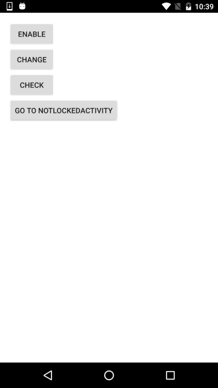
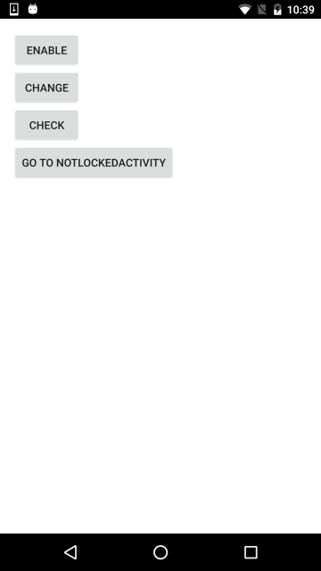

LolliPin [](https://android-arsenal.com/details/1/1425)
================

A Lollipop material design styled android pincode library (API 10+)


To include in your project, add this to your build.gradle file:

```
   //Lollipin
   compile 'com.github.orangegangsters:lollipin:1.7.1@aar'
```

 

========
### By
Developers:
        [Olivier Goutay](https://github.com/olivierg13) and [Stoyan Dimitrov](https://github.com/StoyanD) and [Dae Park](https://github.com/daespark)
        
Contributors:
        [Art Beatte IV](https://github.com/abeatte), [Alex Morgan](https://github.com/axemorgan)

Designers:
        [Yassine Bentaieb](http://yassinebentaieb.com/)

========
### Security

##### Password protection
The password itself is not saved, only its hash using the SHA-1 algorithm.
This hash is then saved on the SharedPreferences, allowing to verify that the user entered the right PinCode,
without giving the possibility to retrieve it.

##### Introducing Fingerprint
Once the user has enabled the password, he can also use his fingerprint scanner (using Google Api, not Samsung)
to unlock his device.

========
### Usage

If you want an example on how to use it, you can find an example app in this repo.

========
#### Preparing dependencies

We are using a custom version of RippleView that contains a RippleAnimationListener.
In order to be able to fetch this dependency, you need to add these lines into your main build.gradle file:
```
allprojects {
    repositories {
        maven{
            url "https://github.com/omadahealth/omada-nexus/raw/master/release"
        }
        jcenter()

    }
}
```

========
#### Overriding the AppLockActivity

In order to use the "Forgot" system, we let you extend the AppLockActivity class to provide your own way of handling the user behaviour in this case (logout, delete datas etc...)

```
public class CustomPinActivity extends AppLockActivity {
    @Override
    public void showForgotDialog() {
        //Launch your popup or anything you want here
    }
}
```

========
#### Init

Advised to be done by extending the Application, but can be done elsewhere. The method below provides a way to enable or disable the PinCode system:

========
##### Enabling

```
LockManager<CustomPinActivity> lockManager = LockManager.getInstance();
lockManager.enableAppLock(this, CustomPinActivity.class);
```
Once enabled, you must extend "PinActivity" for every Activity you wish to protect.

========
##### Disabling

```
LockManager<CustomPinActivity> lockManager = LockManager.getInstance();
lockManager.disableAppLock();
```

========
#### Set up the PinCode

Whenever you want the user to set up his pin code, you need to request:

```
Intent intent = new Intent(MainActivity.this, CustomPinActivity.class);
intent.putExtra(AppLock.EXTRA_TYPE, AppLock.ENABLE_PINLOCK);
startActivityForResult(intent, REQUEST_CODE_ENABLE);
```

========
#### Unlock system

As soon as you enable the PinCode system, the Unlock screen will appear by itself when the user resume the app after a defined timeout.
Please refer to the next section to know how to customize these values.

========
### Customization

Some features are customizable:

The unlock timeout:
-------------------

```
LockManager<CustomPinActivity> lockManager = LockManager.getInstance();
lockManager.getAppLock().setTimeout(10000);
```

The pin length required:
-------------------

```
public class CustomPinActivity extends AppLockActivity {

    ...
    ...

    @Override
    public int getPinLength() {
        return 5;
    }

    ...
    ...
}
```

The logo displayed at the top of the page:
-------------------

```
LockManager<CustomPinActivity> lockManager = LockManager.getInstance();
lockManager.getAppLock().setLogoId(R.drawable.security_lock);
```

The ignored activities:
-------------------
For instance you got a login activity that you want to avoid getting the lock screen, you can ignore this activity by doing:

```
LockManager<CustomPinActivity> lockManager = LockManager.getInstance();
lockManager.getAppLock().addIgnoredActivity(NotLockedActivity.class);
```

The AppLockActivity Layout:
-------------------
By providing a custom layout to getContentView() you can alter how your AppLockActivity looks.
However, you must include 4 required elements:
- TextView with an id of pin_code_step_textview
- TextView with an id of pin_code_forgot_textview
- PinCodeRoundView with an id of pin_code_round_view
- KeyboardView with an id of pin_code_keyboard_view

```
@Override
    public int getContentView() {
        return R.layout.activity_pin;
    }
```

The Pin Dots:
-------------------
By supplying alternate drawable resources for app:lp_empty_pin_dot and app:lp_full_pin_dot you can custimize how it looks.

```
<com.github.orangegangsters.lollipin.lib.views.PinCodeRoundView
                android:id="@+id/pin_code_round_view"
                android:layout_width="wrap_content"
                android:layout_height="wrap_content"
                android:layout_marginTop="@dimen/pin_code_round_top_margin"
                android:layout_marginBottom="@dimen/pin_code_elements_margin"
                app:lp_empty_pin_dot="@drawable/pin_empty_dot"
                app:lp_full_pin_dot="@drawable/pin_full_dot"/>
```

========

### Credits

* We used the RippleEffect library from Traex (https://github.com/traex/RippleEffect) to implement the Ripple effect from material design on API 10+
* We used the L-dialogs library from lewisjdeane (https://github.com/lewisjdeane/L-Dialogs) to demonstrate how to use a popup for the "forgot" button
* We used the Robotium library from RobotiumTech (https://github.com/RobotiumTech/robotium) to run powerful unit and functional testing

========

### License

```
The MIT License (MIT)

Copyright (c) 2015 OrangeGangsters

Permission is hereby granted, free of charge, to any person obtaining a copy
of this software and associated documentation files (the "Software"), to deal
in the Software without restriction, including without limitation the rights
to use, copy, modify, merge, publish, distribute, sublicense, and/or sell
copies of the Software, and to permit persons to whom the Software is
furnished to do so, subject to the following conditions:

The above copyright notice and this permission notice shall be included in all
copies or substantial portions of the Software.

THE SOFTWARE IS PROVIDED "AS IS", WITHOUT WARRANTY OF ANY KIND, EXPRESS OR
IMPLIED, INCLUDING BUT NOT LIMITED TO THE WARRANTIES OF MERCHANTABILITY,
FITNESS FOR A PARTICULAR PURPOSE AND NONINFRINGEMENT. IN NO EVENT SHALL THE
AUTHORS OR COPYRIGHT HOLDERS BE LIABLE FOR ANY CLAIM, DAMAGES OR OTHER
LIABILITY, WHETHER IN AN ACTION OF CONTRACT, TORT OR OTHERWISE, ARISING FROM,
OUT OF OR IN CONNECTION WITH THE SOFTWARE OR THE USE OR OTHER DEALINGS IN THE
SOFTWARE.
```
